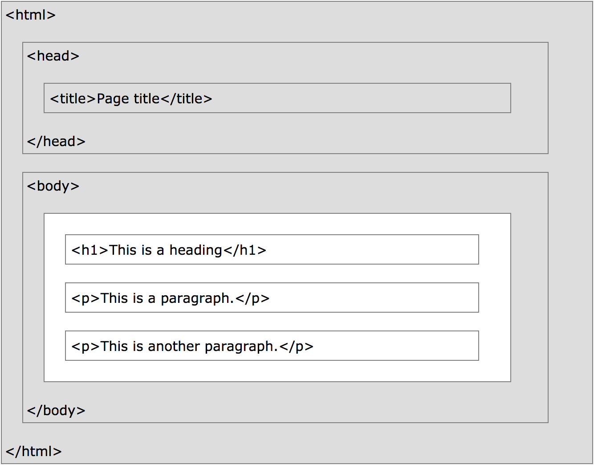
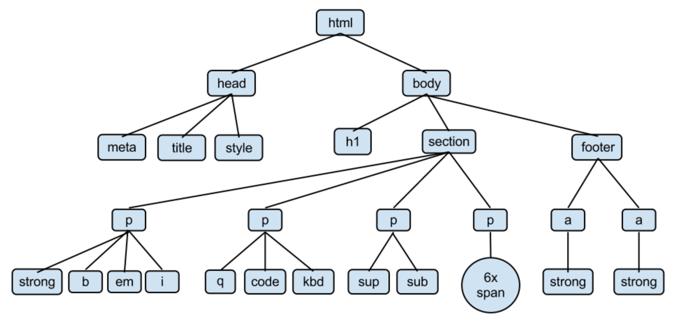
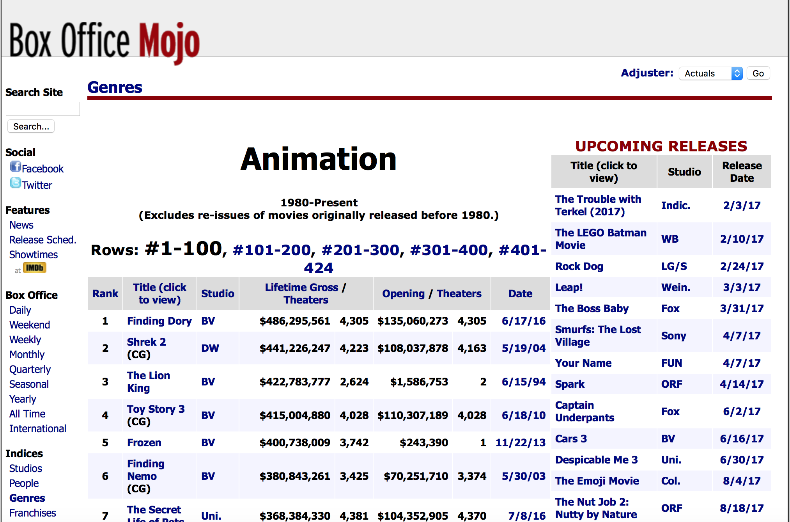

What is web scrapping?

Web scrapping involves extracting data that is on websites, and converting it into a format that can be used for data annlysis.

There are several tools for web scrapping, Beautiful Soup being  just one of them. Beautiful Soup is a python library for pulling data out of HTML and XML files.

In this post, we will learn how to do webscrapping of movie data: 

a. Getting started with Beautiful Soup
To install Beautiful Soup, do  

```python
$ pip install beautifulsoup4
```

b. HTML page structure
Before beginning web scrapping, it is useful to know the structure of a HTML Document.
Below is a visualization of an HTML page structure:


The <html> element is the root element of an HTML page
The <head> element contains meta information about the document
The <title> element specifies a title for the document
The <body> element contains the visible page content
The <h1> element defines a large heading
The <p> element defines a paragraph

The tags in a html document, help us identify the different elements in a html document. The start and end of a tag, follows this syntax:

<tag_name>content...</tag_name>

Tags come in pairs, and the first tag in the pair is a start tag and the second tag is the end tag. A start tag also often contains "attributes" with info about the element.Attributes usually have a name and value. 

For example, <p class="my_red_sentences">You are beginning to learn HTML.</p>
Our task at hand, is the identify the tags that contain the information we are interested in and extract the information.


Beautiful Soup contains a set of wrapper functions that make it easy to select common HTML elements.

c. Scrapping: I scrapped movie data for my project and here is the image of the website, we will scape data from.


Steps:
Using, the requests library, we can get and view the content of the HTML page.

```python
import requests
from bs4 import BeautifulSoup
```

```python
url = 'http://www.boxofficemojo.com/genres/chart/?id=animation.htm&sort=rank&order=ASC&p=.htm'
response = requests.get(url)
page = response.text
```
Using the Beautiful Soup function, we will create a Beautiful soup object. 
The soup object contains all of the HTML in the original document.
```python
soup = BeautifulSoup(page,"lxml")
soup.prettify()
```
I am interested in getting the movie name, movie url, release date and domestic gross of the movie. Upon doing an 'Inspect' of the page, I learn that the information I need is the table tag. So I will look for 'table'.
```python
tables = soup.find_all('table')
```
Upon identifying the table of interest, aka, table 3, the inforamtion I am interested in grabbing is within the tr tag of the table.
```python
rows=[row for row in tables[3].find_all('tr')]
```
```python
rows=[row for row in tables[3].find_all('tr')]
```
I then look for the td tag.
```python
items = row.find_all('td')
```
The movie name and release_date can be identified with the 'a' tag, using a .text function. The movie link can be found using the a href tag. The domestic gross, just has a td tag, and using the .text function, we can get the domestic gross amount.
```python
name = items[1].find('a').text
release_date = items[7].find('a').text
movie_link= items[1].find('a')['href']
domestic_gross = items[3].text
```
Follow these steps to scrape your first webpage!

```
